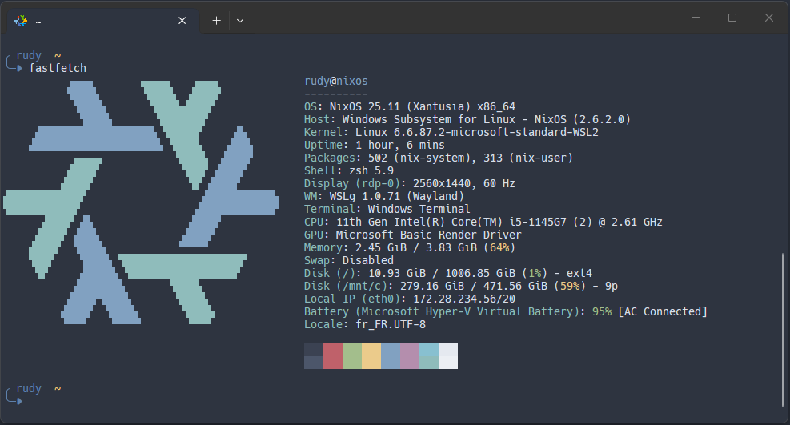

# ❄️ NixOS-WSL - DevOps

Ce repo permet de builder une distribution **NixOS-WSL** prête à l’emploi dans WSL2.

# Avantages ?

Avoir un OS immuable et prêt à l'emploi sans aucun setup manuel !  
Toute la configuration est faite en mode **déclaratif** et **versionnée** dans Git.  
Idéal pour avoir un environnement de développement à partager dans les équipes.

# ✨ Prérequis

- OS : Windows 10/11
- "Virtualization" activée dans les options du BIOS
- WSL : v2.4 ou ultérieur

# 🔎 Fonctionnalités

Cette configuration permet d'avoir un NixOS avec [home-manager](https://nix-community.github.io/home-manager/index.xhtml#ch-introduction) et des modules dédiés à l'installation d'outils comme :
 - Zsh + Starship + quelques plugins OhMyZsh
 - Compatibilité avec VSCode (plugin remote-ssh)
 - Multitude de paquets et de plugins orientés Kubernetes / Cloud Native 👉 [consulte la liste ici](./modules/k8s.nix)
 - Gestion des secrets via AGE / SOPS (_à venir_)

#  🔗 Sources

Projet NixOS-WSL (maintenu par la communauté NixOS) : https://github.com/nix-community/NixOS-WSL


# 🚀 Premier build depuis les releases GitHub

Il faut d'abord déployer [nixos.wsl](https://github.com/nix-community/NixOS-WSL/releases/download/2505.7.0/nixos.wsl) sur son poste avant de cloner le repo et de lancer le build avec les commandes qui suivent :

```bash
# Installe le paquet git dans nixos
nix --extra-experimental-features "nix-command flakes" shell nixpkgs#git

# clone du projet dans le répertoire courant
git clone https://github.com/rguyennot/nixos-wsl.git

cd nixos-wsl/

# Lance la compilation (peut prendre plusieurs minutes et peut saturer les IOPS d'un SSD...)
sudo nixos-rebuild switch --flake .#wsl
```

Si tout se passe bien, la fin de la compilation indique que la configuration a été ajoutée dans /nix/store.
```
building the system configuration...
...
Done. The new configuration is /nix/store/kbjfrshrsj3qvcimvbvzs00q8lwlakn8-nixos-system-nixos-wsl-25.11.20260216.fa56d7d
```
⚠️ **Fermer Windows Terminal (ou PowerShell) avant de relancer la version recompilée de NixOS-WSL** ⚠️ 

 > Au premier lancement, Zsh affiche un assistant zsh-newuser-install car il n’y a pas de fichier ~/.zshrc. Tapez simplement 0 puis Entrée pour créer un fichier minimal et ne plus revoir ce message. La configuration est gérée par NixOS, pas par ce fichier utilisateur.

# 🎉 Résultat



# 🙋‍♂️ FAQ

> Et si je veux apporter des modifications à la configuration actuelle (_ex: installer un nouveau paquet_), je suis obligé de repartir de zéro ?

 - Non. Après un premier build abouti, il suffit de mettre à jour le projet Git et de relancer un build avec la commande `sudo nixos-rebuild switch --flake .#wsl` puis de relancer NixOS dans un terminal WSL.

# 👀 Inspirations

 - Stéphane Robert : https://blog.stephane-robert.info/docs/securiser/os-immuable/nixos/installation-wsl/
 - https://github.com/kenlasko/nixos-wsl
 - https://github.com/abhishekbhar/nixconf
 - https://github.com/AlexNabokikh/nix-config

# 📖 Bibles NixOS

 - Search NixOS Packages : https://search.nixos.org/packages?channel=25.11
 - Doc NixOS-WSL : https://nix-community.github.io/NixOS-WSL/install.html

# ToDo

- Revoir la gestion des secrets via SOPS/AGE : s'inspirer de https://github.com/kenlasko/nixos-wsl?tab=readme-ov-file#configuring-sops
- Gestion des clés SSH


